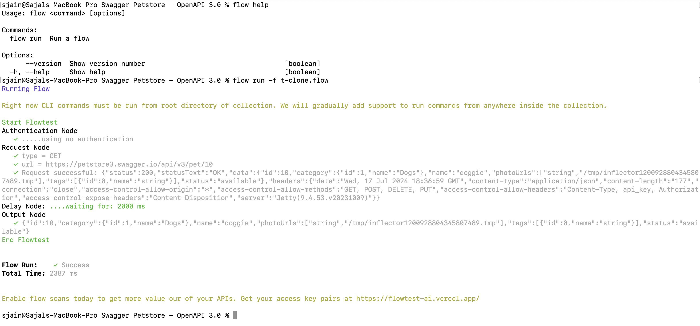
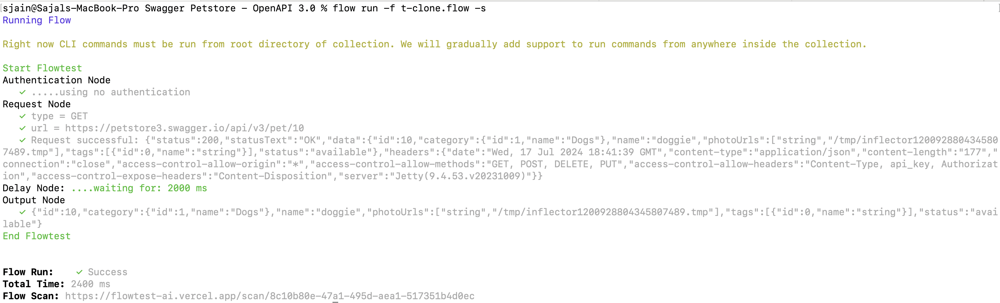

# flowtestai-cli

With FlowTestAI CLI, you can now run your end to end tests directly from command line.

This makes it easier to run your tests in different environments, automate your testing process, and integrate your tests with your continuous integration and deployment workflows.

## Installation

To install the FlowTestAI CLI, use the node package manager of your choice, such as NPM:

```bash
npm install -g @flowtestai/cli
```

## Getting started

Navigate to the root directory of your collection, and then run:

```bash
flow run help
```

This command will give you various options you can use to run a flow. You can also run a single flow by specifying its filename with the `--file` or `-f` option:

```bash
flow run -f test.flow
```

Or run a requests inside a subfolder:

```bash
flow run -f folder/subfolder/test.flow
```

If you need to use an environment, you can specify it with the `--env` or `-e` option:

```bash
flow run -f test.flow -e environments/test.env
```

If you need to publish the results of your flow runs for further analysis, you can specify the `-s` option. Request your access key pairs from https://flowtest-ai.vercel.app/ and then export $FLOWTEST_ACCESS_ID and $FLOWTEST_ACCESS_KEY

```bash
flow run -f test.flow -e environments/test.env -s
```

## Demo




## Support

If you encounter any issues or have any feedback or suggestions, please raise them on our [GitHub repository](https://github.com/FlowTestAI/FlowTest)

Thank you for using Bruno CLI!

## Changelog

See [https://github.com/FlowTestAI/FlowTest/releases](https://github.com/FlowTestAI/FlowTest/releases)

## License

[MIT](LICENSE.md)
